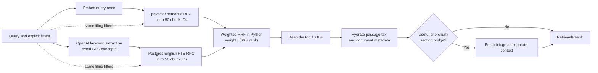
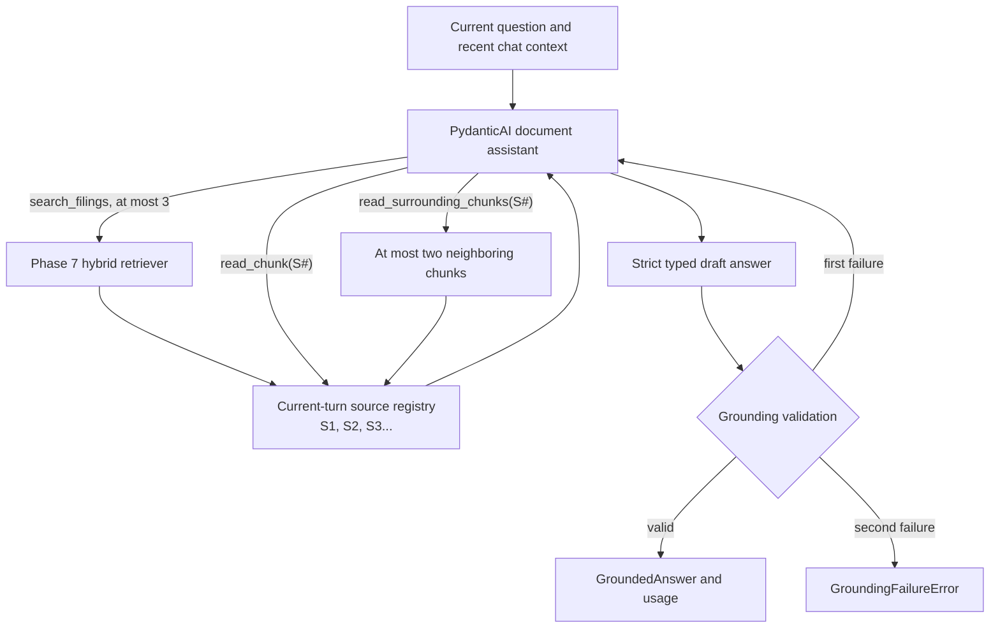

# Document Copilot backend

FastAPI owns authentication, retrieval, AI orchestration, grounding, and database access.

## Set up

From this folder:

```bash
uv sync
```

Create `.env` from `.env.example` and fill in every value. `app/config.py` validates the file when the application starts.

## Run

```bash
uv run uvicorn app.main:app --reload
```

- Health check: <http://localhost:8000/health>
- Interactive API docs: <http://localhost:8000/docs>

## Check changes

```bash
uv run pytest
uv run ruff check app tests
uv run ruff format --check app tests
```

Preview pending migration SQL without changing the database:

```bash
uv run alembic upgrade head --sql
```

## Ingest converted SEC filings

From `backend/`, validate the manifest and Markdown corpus without changing Supabase:

```bash
uv run python -m ingestion.ingest_documents --dry-run
```

Upsert the documents into `source_documents` using the configured service-role key:

```bash
uv run python -m ingestion.ingest_documents
```

Rows are matched by SEC accession number, so the command is safe to rerun.

## Chunk, embed, and ingest filing passages

The chunking pipeline loads the native Docling JSON files and uses Docling's
`HierarchicalChunker`. Each table stays in one chunk. Tables use a compact row
serialization for embedding, while source offsets are located against the
non-compact normalized Markdown.

Validate one filing's hierarchy, table integrity, source offsets, and token limits:

```bash
uv run python -m ingestion.chunk_documents \
  --accession-number 0000320193-24-000123
```

Validate the complete local corpus without calling OpenAI or Supabase:

```bash
uv run python -m ingestion.ingest_chunks --dry-run
```

Run a deliberately bounded paid embedding test without database writes:

```bash
uv run python -m ingestion.create_embeddings \
  --accession-number 0000320193-24-000123 \
  --limit-chunks 3
```

After `source_documents` has been ingested, embed and upsert the complete corpus:

```bash
uv run python -m ingestion.ingest_chunks
```

To embed and upsert one complete filing instead, add
`--accession-number <accession>`. Chunk rows are matched by document ID and chunk
index, so reruns update stable rows and remove only a stale trailing range.

## Hybrid retrieval

Apply the latest Alembic migration before retrieval. It adds separate, bounded
Supabase RPC functions for pgvector similarity and Postgres full-text search;
Python combines their rankings with Reciprocal Rank Fusion.



The retriever starts two complete pipelines concurrently. The semantic pipeline
embeds the original question once and immediately runs pgvector search. The lexical
pipeline asks a configured OpenAI model for bounded, typed groups of SEC-relevant
terms, then searches with their normalized, deduplicated text. Both database calls
use identical company, ticker, filing-type, fiscal-year, and filing-date filters.
A failure in either pipeline fails the request instead of silently changing
retrieval behavior.

The extraction prompt removes conversational framing and preserves evidence-bearing
filing concepts such as named segments, financial metrics, risks, causes, and exact
phrases. PostgreSQL's `english` text-search dictionary then performs stemming and
stop-word removal against the indexed `search_vector`; no separate NLP runtime
dependency is needed. Extracted groups and the final lexical query are recorded in
evaluation output for inspection. `OPENAI_KEYWORD_MODEL` configures the extraction
model; the evaluated default is `gpt-5.4-nano`.

RRF combines ranks rather than incomparable vector and text-search scores. It
deduplicates IDs and uses deterministic tie-breaking. The corpus-tuned weights are
20 for semantic and 1 for lexical, with `k=60`. Only the final ten chunks are
hydrated. A missing middle chunk is added only when it bridges two retained chunks
from the same document and section, and it remains separate from ranked evidence
so it cannot affect RRF or evaluation metrics.

### Inspect retrieval interactively

Open `playground/inspect_retrieval.py` in the editor with the backend IPython
kernel selected. Edit `QUERY` and `FILTERS`, then run each `# %%` cell with
Shift+Enter. There are no command-line arguments and no terminal workflow.

The small playground calls `evaluation.inspect_retrieval`, which runs the real
OpenAI/Supabase pipeline and logs the extracted keywords, FTS query, semantic and
lexical timings, branch candidates, RRF ranks, stable passage keys, and text
snippets. The last cell displays the final chunks in `result.hybrid_passages`;
`result.semantic_passages` and `result.lexical_passages` remain available when you
want to compare the two source rankings.

### Run the retrieval evaluation

The checked-in evaluation set contains atomic evidence lookups derived from the
client brief. Run it against the ingested corpus without invoking the answer model:

```bash
uv run python -m evaluation.run_retrieval \
  --output evaluation/results/retrieval-baseline.json
```

The command records semantic-only, lexical-only, and hybrid NDCG@10, hit rate,
evidence-group recall, latency, and the exact retrieval configuration. It exits
nonzero unless every hybrid case has a relevant top-10 passage and hybrid mean
NDCG@10 meets or exceeds both individual retrievers.

The live sample-corpus tuning run selected semantic/lexical RRF weights of 20:1.
This is the smallest recorded ratio that passed the frozen acceptance set; the
retriever and evaluation command use it by default. See
`evaluation/results/tuning-summary.md` for the recorded comparison.

## Grounded document assistant

Phase 8 adds a PydanticAI assistant behind a directly callable Python boundary. It
is deliberately not connected to `POST /chat/stream` yet; Phase 9 will replace the
stub only after the assistant returns a fully validated result.



Search results expose bounded previews. The agent must explicitly read a passage
before it can cite it, and citations use current-turn labels such as `[S1]` rather
than model-supplied database UUIDs. The grounding validator then verifies that
inline markers, structured citation references, exact excerpts, and retrieved
passages agree. Unsupported questions return a fixed, uncited corpus-insufficiency
statement. Investment questions may receive cited factual context, but always end
with the fixed investment-advice refusal.

Each run receives a fresh `AssistantDeps` containing the authenticated user and
thread IDs, the Phase 7 retriever, model settings, validator, and evidence registry.
Only the latest three complete chat turns are included, and old source labels or
tool transcripts are never reused. The assistant is bounded to three searches,
three surrounding reads, 12 total tool calls, eight model requests, and 64 unique
passages per turn.

### Inspect the assistant interactively

Open `playground/inspect_assistant.py` with the backend IPython kernel selected,
then run its `# %%` cells in order with Shift+Enter. Paste an authenticated
Supabase access token into the hidden prompt, edit `QUESTION`, and run the assistant
cell. There are no arguments and no terminal command.

This is the real Phase 8 workflow, not a second implementation. It constructs a
user-scoped Supabase client, runs the PydanticAI assistant, and logs each bounded
tool call and result. At the end it shows every current-turn `S#` passage, whether
the assistant read or cited it, the validated answer and exact excerpts, and model
usage. The last two cells leave the typed answer and evidence records available for
normal IPython inspection.

Configure answer generation separately from embeddings and keyword extraction:

```dotenv
OPENAI_ASSISTANT_MODEL=gpt-5.6-terra
OPENAI_ASSISTANT_REASONING_EFFORT=medium
OPENAI_ASSISTANT_MAX_OUTPUT_TOKENS=3000
```

The fast test suite never calls Supabase or OpenAI:

```bash
uv run pytest -m "not integration"
```

To run the authenticated live retrieval and grounded-assistant tests deliberately,
put a current test-user token in the gitignored `.env.integration` file and select
the integration marker:

```dotenv
SUPABASE_TEST_ACCESS_TOKEN=<token>
```

```bash
uv run --env-file .env.integration pytest -m integration
```

## Use in Python or Jupyter

Use the backend virtual environment, then import shared settings through:

```python
from app.config import settings
```

Never read environment variables directly in other backend modules.
