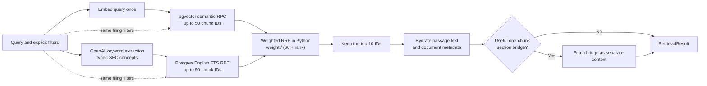
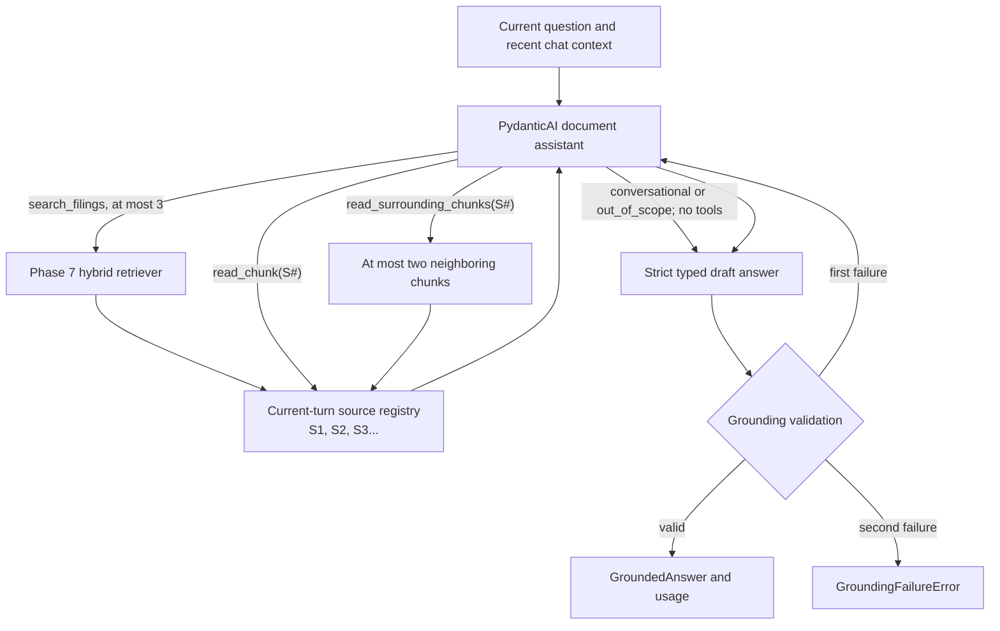

# Document Copilot backend

FastAPI owns authentication, retrieval, AI orchestration, grounding, and database access.

## Set up

From this folder:

```bash
uv sync
```

Create `.env` from `.env.example` and fill in every value. `app/config.py` validates the file when the application starts.

## Run

```bash
uv run uvicorn app.main:app --reload
```

- Health check: <http://localhost:8000/health>
- Interactive API docs: <http://localhost:8000/docs>

### Trace assistant turns

Every `POST /chat/stream` receives a unique `trace_id`. With the local values in
`.env.example`, the backend prints a readable, ordered trace covering the accepted
question, selected history, every assistant model request and response, tool calls
and results, keyword extraction, embeddings, retrieval rankings, grounding,
persistence, and final SSE delivery.

```dotenv
APP_ENVIRONMENT=development
LOG_LEVEL=INFO
LOG_FORMAT=console
ASSISTANT_TRACE_MODE=full
ASSISTANT_TRACE_MAX_CONTENT_CHARACTERS=12000
LOG_MAX_EVENT_BYTES=4096
```

The important event sequence is:

```text
chat_turn_received
assistant_model_request -> assistant_model_response
assistant_tool_started -> retrieval_* -> assistant_tool_completed
assistant_grounding_proposed -> assistant_grounding_accepted|rejected
chat_turn_persistence_started -> chat_turn_persistence_completed
chat_turn_completed -> chat_stream_completed
```

Filter a busy terminal or Railway log search by the emitted `trace_id` to isolate
one turn. Model requests contain the semantic messages and tool/output definitions
assembled by PydanticAI. Model responses contain observable response parts, tool
decisions, usage, and finish metadata; private hidden reasoning is deliberately not
recorded.

Use safe, structured settings in Railway:

```dotenv
APP_ENVIRONMENT=production
LOG_LEVEL=INFO
LOG_FORMAT=json
ASSISTANT_TRACE_MODE=summary
ASSISTANT_TRACE_MAX_CONTENT_CHARACTERS=12000
LOG_MAX_EVENT_BYTES=4096
```

`summary` is metadata-only: it keeps the trace sequence, stages, durations, model and
tool names, status values, safe error classifications, counts, and token/cost usage.
It never records prompts, history, answers, retrieval content, tool payloads, runtime
identifiers other than `trace_id`, exception messages, or tracebacks. Production JSON
events are capped at 4 KiB. `full` preserves content-rich diagnostics locally up to
the configured per-value bound, with secrets and provider-private fields redacted or
omitted. Production rejects `full` at startup. Set `ASSISTANT_TRACE_MODE=off` to keep
only completion, failure, timeout, disconnect, and handled-request operational logs.

## Check changes

```bash
uv run pytest
uv run ruff check app tests
uv run ruff format --check app tests
```

Preview pending migration SQL without changing the database:

```bash
uv run alembic upgrade head --sql
```

## Ingest SEC filings

The active pipeline parses downloaded SEC HTML with a custom `lxml` parser, writes
normalized Markdown and structured section data, creates section-aware chunks, and
saves chunks and embeddings locally before uploading anything to Supabase.

Run the stages from the repository root:

```bash
backend/ingestion/scripts/01_prepare_local.sh
backend/ingestion/scripts/02_create_embeddings.sh
backend/ingestion/scripts/03_upload_supabase.sh
backend/ingestion/scripts/04_verify_supabase.sh
```

The local checkpoint layout is:

```text
data/ingestion_runs/sec_sections_v2/<accession>/
├── checkpoint.json
├── chunks.jsonl
├── chunks.md
└── embeddings/
    ├── checkpoint.json
    └── embeddings.jsonl.gz
```

Stage 1 is local and free. Stage 2 calls Azure AI Foundry, stage 3 writes
`source_documents` and `document_chunks`, and stage 4 independently compares
Supabase with the local checkpoints. Valid completed documents are reused, so an
interrupted run can safely be restarted. Embedding and upload scripts also accept
one optional SEC accession number for a focused retry.

The parser supports `10-K`, `F-1`, and `424B4`. Prose chunks are at least 100 tokens
and normally at most 500; a minimum-size merge may reach 600. Complete data tables
remain atomic up to the embedding model's 8,192-token limit, and an otherwise
unmergeable small table is the only allowed sub-100-token exception.

For implementation details, checkpoint formats, direct module commands, reset
safety, and corpus metrics, see
[`ingestion/README.md`](ingestion/README.md).

## Hybrid retrieval

Apply the latest Alembic migration before retrieval. It adds separate, bounded
Supabase RPC functions for pgvector similarity and Postgres full-text search;
Python combines their rankings with Reciprocal Rank Fusion.



The retriever starts two complete pipelines concurrently. The semantic pipeline
embeds the original question once and immediately runs pgvector search. The lexical
pipeline asks a configured OpenAI model for bounded, typed groups of SEC-relevant
terms, then searches with their normalized, deduplicated text. Both database calls
use identical company, ticker, filing-type, fiscal-year, and filing-date filters.
A failure in either pipeline fails the request instead of silently changing
retrieval behavior.

The extraction prompt removes conversational framing and preserves evidence-bearing
filing concepts such as named segments, financial metrics, risks, causes, and exact
phrases. PostgreSQL's `english` text-search dictionary then performs stemming and
stop-word removal against the indexed `search_vector`; no separate NLP runtime
dependency is needed. Extracted groups and the final lexical query are recorded in
evaluation output for inspection. `AZURE_OPENAI_KEYWORD_DEPLOYMENT` selects the
Azure deployment while `OPENAI_KEYWORD_MODEL` records its underlying model identity;
the evaluated default is `gpt-5.4-nano`.

RRF combines ranks rather than incomparable vector and text-search scores. It
deduplicates IDs and uses deterministic tie-breaking. The corpus-tuned weights are
20 for semantic and 1 for lexical, with `k=60`. Only the final ten chunks are
hydrated. A missing middle chunk is added only when it bridges two retained chunks
from the same document and section, and it remains separate from ranked evidence
so it cannot affect RRF or evaluation metrics.

### Inspect retrieval interactively

Open `playground/inspect_retrieval.py` in the editor with the backend IPython
kernel selected. Edit `QUERY` and `FILTERS`, then run each `# %%` cell with
Shift+Enter. There are no command-line arguments and no terminal workflow.

The small playground calls `evaluation.inspect_retrieval`, which runs the real
OpenAI/Supabase pipeline and logs the extracted keywords, FTS query, semantic and
lexical timings, branch candidates, RRF ranks, stable passage keys, and text
snippets. The last cell displays the final chunks in `result.hybrid_passages`;
`result.semantic_passages` and `result.lexical_passages` remain available when you
want to compare the two source rankings.

### Run the retrieval evaluation

The checked-in evaluation set contains atomic evidence lookups derived from the
client brief. Run it against the ingested corpus without invoking the answer model:

```bash
uv run python -m evaluation.run_retrieval \
  --output evaluation/results/retrieval-baseline.json
```

The command records semantic-only, lexical-only, and hybrid NDCG@10, hit rate,
evidence-group recall, latency, and the exact retrieval configuration. It exits
nonzero unless every hybrid case has a relevant top-10 passage and hybrid mean
NDCG@10 meets or exceeds both individual retrievers.

The live sample-corpus tuning run selected semantic/lexical RRF weights of 20:1.
This is the smallest recorded ratio that passed the frozen acceptance set; the
retriever and evaluation command use it by default. See
`evaluation/results/tuning-summary.md` for the recorded comparison.

## Grounded document assistant

Phase 8 adds a PydanticAI assistant behind a directly callable Python boundary.
Phase 9 connects that boundary to `POST /chat/stream` through the request-scoped
chat orchestrator. The endpoint never exposes model text until the answer has passed
grounding validation and the complete turn has been committed atomically.



Search results expose bounded previews. The agent must explicitly read a passage
before it can cite it, and citations use current-turn labels such as `[S1]` rather
than model-supplied database UUIDs. The grounding validator then verifies that
inline markers, structured citation references, ordered source excerpt fragments,
and retrieved passages agree. Excerpts may use ellipses for omitted source text and
may vary punctuation only at fragment boundaries. Greetings and onboarding can
return concise `conversational` answers without retrieval, while unrelated requests
return an `out_of_scope` redirect. Both paths prohibit searches, citations, and
source markers. Unsupported filing questions return a fixed, uncited
corpus-insufficiency statement. Investment
questions may receive cited factual context, but always end with the fixed
investment-advice refusal.

Each run receives a fresh `AssistantDeps` containing the authenticated user and
thread IDs, the Phase 7 retriever, model settings, validator, and evidence registry.
Only the latest three complete chat turns are included, and old source labels or
tool transcripts are never reused. The assistant is bounded to three searches,
three surrounding reads, 12 total tool calls, eight model requests, and 64 unique
passages per turn.

### Inspect the assistant interactively

Open `playground/inspect_assistant.py` with the backend IPython kernel selected,
then run its `# %%` cells in order with Shift+Enter. Paste an authenticated
Supabase access token into the hidden prompt, edit `QUESTION`, and run the assistant
cell. There are no arguments and no terminal command.

This is the real Phase 8 workflow, not a second implementation. It constructs a
user-scoped Supabase client, runs the PydanticAI assistant, and logs each bounded
tool call and result. At the end it shows every current-turn `S#` passage, whether
the assistant read or cited it, the validated answer and source-backed excerpts, and
model usage. The last two cells leave the typed answer and evidence records available
for normal IPython inspection.

Configure answer generation separately from embeddings and keyword extraction:

```dotenv
AZURE_OPENAI_ENDPOINT=https://<foundry-resource>.openai.azure.com/openai/v1/
AZURE_OPENAI_ASSISTANT_DEPLOYMENT=assistant-gpt-5-6-terra
AZURE_OPENAI_KEYWORD_DEPLOYMENT=keywords-gpt-5-4-nano
AZURE_OPENAI_EMBEDDING_DEPLOYMENT=embeddings-text-embedding-3-small
OPENAI_ASSISTANT_MODEL=gpt-5.6-terra
OPENAI_ASSISTANT_REASONING_EFFORT=medium
OPENAI_ASSISTANT_MAX_OUTPUT_TOKENS=3000
CHAT_TURN_TIMEOUT_SECONDS=180
```

Successful streams emit AI SDK text parts, SEC `source-url` parts, and typed
`data-citation` parts containing the validated excerpt and filing locators used by
the frontend source panel. The user message, validated assistant message, normalized
citations, model usage, thread timestamp, and first-question title are written by
one RLS-aware Postgres function. A failed grounding check, upstream failure,
timeout, or cancellation never creates a partial assistant message. Client message
IDs make a retry idempotent when a completed response was lost in transit.

The fast test suite never calls Supabase or Azure AI Foundry:

```bash
uv run pytest -m "not integration"
```

To run the authenticated live retrieval and grounded-assistant tests deliberately,
put a current test-user token in the gitignored `.env.integration` file and select
the integration marker:

```dotenv
SUPABASE_TEST_ACCESS_TOKEN=<token>
```

```bash
uv run --env-file .env.integration pytest -m integration
```

## Use in Python or Jupyter

Use the backend virtual environment, then import shared settings through:

```python
from app.config import settings
```

Never read environment variables directly in other backend modules.
