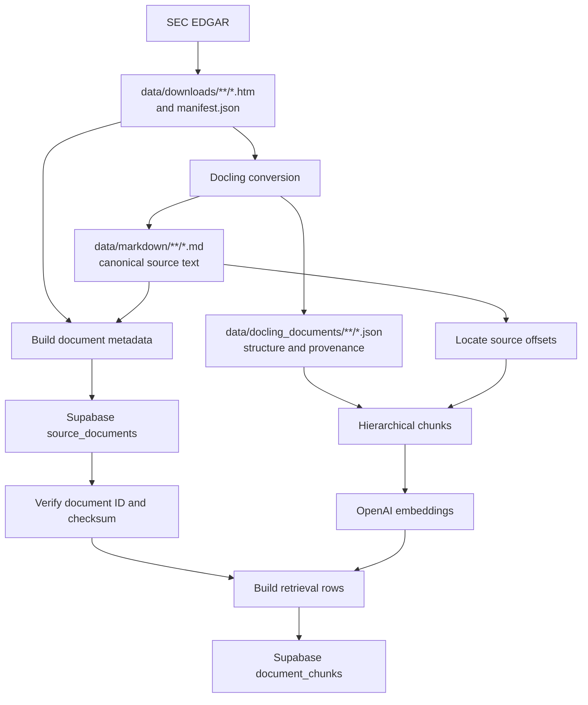

# SEC filing ingestion pipeline

This directory contains the one-off pipeline that turns downloaded SEC filing HTML
into retrieval-ready rows in Supabase. The most important detail is that Docling
produces **two representations of every filing**:

- Markdown is the canonical, readable source stored in `source_documents`.
- Native Docling JSON preserves headings, tables, and provenance for chunking.

The backend does not split the Markdown by character count. It chunks the native
Docling document by structure, then uses the Markdown only to map each chunk back to
its source text.

## End-to-end flow



| Stage | Code | Result |
| --- | --- | --- |
| Download | [`data/download.py`](../../data/download.py) | Raw HTML plus `manifest.json` |
| Convert | [`data/convert_documents.py`](../../data/convert_documents.py) | Matching Markdown and Docling JSON files |
| Build/store documents | [`ingest_documents.py`](ingest_documents.py) | One `source_documents` row per filing |
| Prepare chunks | [`chunk_documents.py`](chunk_documents.py) | In-memory `PreparedChunk` objects |
| Embed chunks | [`create_embeddings.py`](create_embeddings.py) | One vector per prepared chunk |
| Build/store chunk rows | [`ingest_chunks.py`](ingest_chunks.py) | Retrieval-ready `document_chunks` rows |

The production call chain is visible in
[`ingest_document_chunks()`](ingest_chunks.py):

```python
for source_row in source_rows:
    accession_number = source_row["accession_number"]
    docling_path, markdown_path = document_paths(source_row)
    chunks = chunk_document(docling_path, markdown_path, token_counter)
    embedding_result = await create_embeddings(
        embedding_client,
        chunks,
        model=embedding_model,
        dimensions=embedding_dimensions,
    )
    rows = build_document_chunk_rows(
        source_row,
        stored_documents[accession_number]["id"],
        chunks,
        embedding_result.vectors,
        embedding_model=embedding_model,
        embedding_dimensions=embedding_dimensions,
    )
    await upsert_document_chunks(supabase_client, rows)
```

## 1. Download raw filings and create the manifest

Run this from the repository root:

```bash
uv run data/download.py
```

[`download_filings()`](../../data/download.py) selects supported SEC filings, saves
their HTML under a year directory, and records the identity of each file in
`data/downloads/manifest.json`:

```python
local_path.write_bytes(get_bytes(source_url))

manifest["filings"].append(
    {
        "ticker": ticker,
        "cik": cik,
        "form": filing["form"],
        "filing_date": filing["filing_date"],
        "report_date": filing["report_date"],
        "accession_number": filing["accession_number"],
        "primary_document": filing["primary_document"],
        "source_url": source_url,
        "local_path": str(local_path.relative_to(OUTPUT_DIR)),
    }
)
```

The manifest is the inventory used by every later stage. By default the downloader
has `CLEAR_OUTPUT_DIR = True`, so it replaces `data/downloads/` when rerun.

## 2. Convert each HTML filing with Docling

Run this from the repository root:

```bash
uv run data/convert_documents.py
```

[`convert_file()`](../../data/convert_documents.py) parses one HTML file once and
writes two files with the same relative path and stem:

```python
result = converter.convert(source_path, raises_on_error=False)

markdown_path, docling_path = output_paths(source_path)
result.document.save_as_markdown(markdown_path)
result.document.save_as_json(docling_path)
```

For example:

```text
data/downloads/2024/aapl_10-k_....htm
    -> data/markdown/2024/aapl_10-k_....md
    -> data/docling_documents/2024/aapl_10-k_....json
```

The Markdown contains normalized readable text. The JSON contains Docling's document
tree: headings, paragraphs, tables, table-cell geometry, labels, and source
provenance. The two outputs have different jobs later; one is not regenerated from
the other.

## 3. Prepare and store the complete source documents

Run these commands from `backend/`:

```bash
# Validate local files only.
uv run python -m ingestion.ingest_documents --dry-run

# Upsert source_documents in Supabase.
uv run python -m ingestion.ingest_documents
```

[`load_source_document_rows()`](ingest_documents.py) reads the manifest. For each
entry, [`_build_source_document_row()`](ingest_documents.py) finds the corresponding
Markdown file, reads it without further text rewriting, validates the dates and
paths, and creates the database payload:

```python
markdown_relative_path = local_path.with_suffix(".md")
markdown_path = markdown_dir / markdown_relative_path
markdown_bytes = markdown_path.read_bytes()
markdown = markdown_bytes.decode("utf-8")

# Selected fields from the complete SourceDocumentRow payload.
row: SourceDocumentRow = {
    "company": company,
    "ticker": ticker,
    "filing_type": _required_string(filing, "form"),
    "filing_date": filing_date,
    "report_date": report_date,
    "accession_number": _required_string(filing, "accession_number"),
    "sec_url": _required_string(filing, "source_url"),
    "normalized_markdown": markdown,
    "extraction_metadata": {
        "source_local_path": local_path.as_posix(),
        "markdown_local_path": markdown_relative_path.as_posix(),
        "converter": "docling",
        "converter_version": "2.119.0",
    },
    "content_checksum": hashlib.sha256(markdown_bytes).hexdigest(),
}
```

Before returning any rows, this stage rejects empty or missing Markdown, unsafe
relative paths, unrecognized tickers, invalid dates, Markdown files not represented
in the manifest, duplicate accession numbers, and duplicate content checksums. If a
manifest has no report date, the filing date is used and that fallback is recorded
in `extraction_metadata`.

[`upsert_source_documents()`](ingest_documents.py) then sends one row at a time to
Supabase through the server-only client, which uses the configured service-role key:

```python
await (
    client.table("source_documents")
    .upsert(row, on_conflict="accession_number", returning=ReturnMethod.minimal)
    .execute()
)
```

The accession number is the stable identity, so rerunning the command updates the
existing document instead of inserting a duplicate. This stage must run before chunk
ingestion because the generated document UUID becomes every chunk's foreign key.

## 4. Resolve the two local inputs for chunking

[`document_paths()`](chunk_documents.py) reads paths saved in the source row's
`extraction_metadata` and derives the matching JSON and Markdown paths:

```python
docling_path = DOCLING_DOCUMENTS_DIR / Path(source_local_path).with_suffix(".json")
markdown_path = MARKDOWN_DIR / markdown_local_path
```

At the start of [`ingest_document_chunks()`](ingest_chunks.py), the pipeline also
loads `id`, `accession_number`, and `content_checksum` from `source_documents`. It
stops if a source row is missing or if its stored checksum differs from the current
local Markdown. That prevents chunks from being attached to a stale version of a
document.

## 5. Turn the Docling document into structural chunks

The central preparation function is [`chunk_document()`](chunk_documents.py):

```python
doc = DoclingDocument.load_from_json(docling_path)
normalized_markdown = markdown_path.read_text(encoding="utf-8")
chunker = HierarchicalChunker(serializer_provider=SourceMarkdownSerializerProvider())
source_chunks = [DocChunk.model_validate(chunk) for chunk in chunker.chunk(doc)]
_validate_table_integrity(doc, source_chunks)
```

`HierarchicalChunker` follows Docling's document hierarchy rather than choosing
arbitrary character boundaries. The custom serializer uses Markdown for tables while
the initial chunks are formed. `_validate_table_integrity()` then verifies that every
table in the Docling document occurs in exactly one chunk. Structural chunks,
including large tables, are never split later.

### How Docling chooses each chunk boundary

This pipeline uses Docling's `HierarchicalChunker`, not the token-aware
`HybridChunker`. In Docling 2.119.0, the hierarchical chunker walks the parsed
document tree in reading order. Its algorithm is approximately:

```python
active_headings = {}
visited = set()

for item, level in document.iterate_items(with_groups=True):
    if isinstance(item, (TitleItem, SectionHeaderItem)):
        level = item.level if isinstance(item, SectionHeaderItem) else 0
        for key in [key for key in active_headings if key >= level]:
            active_headings.pop(key)
        active_headings[level] = item
        continue

    if not isinstance(item, (ListGroup, InlineGroup, DocItem)):
        continue
    if item.self_ref in visited:
        continue

    serialized = serializer.serialize(item=item, visited=visited)
    if not serialized.text:
        continue

    yield DocChunk(
        text=serialized.text,
        meta={
            "doc_items": [span.item for span in serialized.spans],
            "headings": [active_headings[key].text for key in sorted(active_headings)],
        },
    )
```

That produces these boundary rules:

| Parsed Docling element | Chunking behavior |
| --- | --- |
| Title or section heading | Updates the active heading stack. It does not become a standalone chunk. |
| Standalone paragraph or other text item | Usually becomes one chunk. Adjacent ordinary paragraphs are not combined merely because they are short. |
| List group | The list serializer joins its child list items, including nested list structure, into one group chunk. |
| Inline group | Its child fragments are joined into one chunk, with spaces between fragments. |
| Table | The whole serialized table becomes one chunk; rows are not used as separate chunk boundaries. |
| Empty or excluded item | Produces no chunk. |
| Child already serialized as part of a group/table | Is marked as visited and skipped later, preventing duplicate chunks. |

Headings behave like a stack. Given this structure:

```text
# Risk Factors
Paragraph A
## Competition
Paragraph B
# Financial Statements
Paragraph C
```

Docling creates three paragraph chunks. Their active heading paths are respectively
`Risk Factors`, `Risk Factors > Competition`, and `Financial Statements`. A heading
at the same or a shallower level closes the headings below it. Because this pipeline
keeps Docling's default `always_emit_headings=False`, an empty section does not
produce a heading-only chunk.

These decisions are based on the document tree, not on tokens, characters, pages, or
a target number of words. Page provenance is attached later as metadata and does not
determine a boundary. Consequently, a short paragraph may be a very small chunk and
a large table may be a very large chunk.

Each source chunk is transformed into the final retrieval text:

```python
chunk = _compact_table_chunk(source_chunk)
text = chunker.contextualize(chunk)
token_count = token_counter.count_tokens(text)
```

There are two important transformations here:

1. `_compact_table_chunk()` rewrites table content into a compact, embedding-friendly
   form. Cell whitespace is normalized, empty cells are omitted from retrieval text,
   columns use ` | `, and the table starts with `[TABLE]`.
2. `contextualize()` adds the active heading hierarchy to the chunk. A paragraph can
   therefore become `Risk Factors\nRevenue concentration is a risk.` even though the
   paragraph itself only contains the second line.

A compacted table looks like this:

```text
Segment results
[TABLE]
Region | Net sales
2024 | 2023
North America | $100 | $80
```

The final text is counted with `tiktoken` using the configured embedding model. A
chunk over 8,192 tokens raises `ChunkTooLargeError`; it is rejected rather than split
and stripped of its structural context.

### Source offsets and metadata

The code finds the original, non-compacted `source_chunk.text` in the normalized
Markdown. `source_cursor` makes repeated matches move forward through the document:

```python
source_start = normalized_markdown.find(source_chunk.text, source_cursor)
if source_start >= 0:
    source_end = source_start + len(source_chunk.text)
    source_cursor = source_end
else:
    source_start = None
    source_end = None
```

These offsets refer to `source_documents.normalized_markdown`, not necessarily to the
compacted/contextualized chunk text. When an exact match cannot be found, both values
are `None` rather than guessed.

For every chunk, the pipeline also records:

- the deepest active heading as `section_title`;
- `page_number` only when all provenance points to exactly one page;
- all headings and page numbers;
- Docling item references and labels;
- whether the chunk contains a table and its table references;
- the Docling/chunker/serializer versions used.

### Table display data

For a clean table-only chunk, `_display_table()` separately preserves the original
row/column geometry, row and column spans, header flags, empty cells, and each
non-empty cell's offsets inside the final chunk text. This becomes `display_table`.
It is presentation and citation metadata only; the compact chunk text is what is
embedded and searched.

At this point the document has become a list of in-memory `PreparedChunk` values:

```python
@dataclass(frozen=True)
class PreparedChunk:
    chunk_index: int
    text: str
    token_count: int
    page_number: int | None
    section_title: str | None
    source_start: int | None
    source_end: int | None
    metadata: dict[str, object]
    display_table: StoredDisplayTable | None = None
```

No intermediate chunk file is written to disk.

## 6. Create one embedding per prepared chunk

[`create_embeddings()`](create_embeddings.py) groups chunks by both item count and
token count. Defaults are 128 chunks per request and 250,000 total tokens, while each
individual chunk remains limited to 8,192 tokens.

```python
response = await client.embeddings.create(
    input=[chunk.text for chunk in batch],
    model=model,
    dimensions=dimensions,
)
ordered_items = sorted(response.data, key=lambda item: item.index)
batch_vectors = [list(item.embedding) for item in ordered_items]
```

The result indexes are checked before vectors are put back into chunk order, and
every vector must have the configured number of dimensions. The current database
schema requires 1,536 dimensions.

## 7. Build the final chunk rows

[`build_document_chunk_rows()`](ingest_chunks.py) pairs chunks and vectors one for
one, attaches the `source_documents.id`, and enriches the chunk metadata with filing
identity and embedding configuration:

```python
for chunk, embedding in zip(chunks, embeddings, strict=True):
    rows.append(
        DocumentChunkRow(
            document_id=document_id,
            chunk_index=chunk.chunk_index,
            text=chunk.text,
            token_count=chunk.token_count,
            page_number=chunk.page_number,
            section_title=chunk.section_title,
            source_start=chunk.source_start,
            source_end=chunk.source_end,
            metadata=metadata,
            display_table=(
                chunk.display_table.model_dump(mode="json")
                if chunk.display_table is not None
                else None
            ),
            embedding=list(embedding),
            updated_at=timestamp,
        )
    )
```

The resulting database row carries everything needed for semantic retrieval,
lexical retrieval, filtering, source citations, and table rendering.

## 8. Upsert chunks into Supabase

[`upsert_document_chunks()`](ingest_chunks.py) writes ten rows per database request:

```python
for start in range(0, len(rows), batch_size):
    await table.upsert(
        list(rows[start : start + batch_size]),
        on_conflict="document_id,chunk_index",
        returning=ReturnMethod.minimal,
    ).execute()
```

`(document_id, chunk_index)` is stable across reruns, so existing chunk rows are
updated in place. After the upserts, any old chunks with an index greater than the
new final index are deleted. This handles a document that produces fewer chunks after
being reconverted.

Postgres automatically derives `document_chunks.search_vector` from the stored chunk
`text` with English full-text search. The Python pipeline does not send that column.
The stored embedding is indexed separately with pgvector, so the same chunk supports
both lexical and semantic retrieval.

## Running and validating the pipeline

From `backend/`, after configuring `.env` and applying the database migrations:

```bash
# Print each Markdown document's token count, plus the corpus total and mean.
uv run python -m ingestion.helpers

# Check all local chunks; calls neither OpenAI nor Supabase.
uv run python -m ingestion.ingest_chunks --dry-run

# Inspect chunking for one filing; calls neither OpenAI nor Supabase.
uv run python -m ingestion.chunk_documents \
  --accession-number 0000320193-24-000123

# Paid, bounded embedding smoke test; does not write to Supabase.
uv run python -m ingestion.create_embeddings \
  --accession-number 0000320193-24-000123 \
  --limit-chunks 3

# Chunk, embed, and store one complete filing.
uv run python -m ingestion.ingest_chunks \
  --accession-number 0000320193-24-000123

# Chunk, embed, and store every filing in the manifest.
uv run python -m ingestion.ingest_chunks
```

The full `ingest_chunks` command processes one complete document at a time: prepare
all its chunks, embed them, build rows, write them, and then move to the next filing.
If it fails, already completed documents remain stored and the failing filing can be
rerun by accession number.
