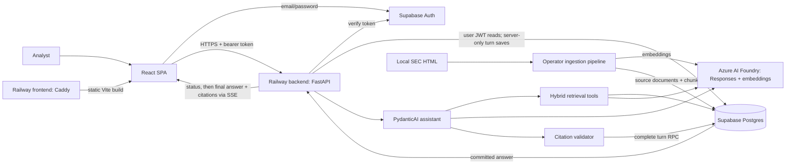

# Document Copilot architecture

This describes the working-tree implementation reviewed on 2026-09-05. The
[client brief](client-brief.md) defines product goals; [project status](todos.md)
tracks gaps and unverified release gates.

## Services and data flow

The frontend has no server-side application runtime: Vite produces static files
served by Caddy. The API is a separate stateless FastAPI service. Supabase hosts
identity and durable data. Model requests use a shared Azure resource's
OpenAI-compatible v1 endpoint, with separate deployment aliases for the assistant,
keyword extraction and embeddings.

## Ownership boundaries

| Component | Responsibilities | Code |
| --- | --- | --- |
| Browser | Session, thread navigation, drafts, retries, citation display | [frontend/src](../frontend/src/) |
| HTTP boundary | Token verification, request validation, thread CRUD and SSE | [api/chat.py](../backend/app/api/chat.py), [auth/dependencies.py](../backend/app/auth/dependencies.py) |
| Orchestrator | Prepare a turn, reuse completed retries, construct dependencies, persist | [chat/orchestrator.py](../backend/app/chat/orchestrator.py) |
| Assistant | Policy, typed output, bounded model/tool loop | [assistant/agent.py](../backend/app/assistant/agent.py), [assistant/policy.py](../backend/app/assistant/policy.py) |
| Retrieval | Semantic/lexical branches, rank fusion, hydration and neighbors | [retrieval/](../backend/app/retrieval/) |
| Grounding | Citation identity, read-before-cite and excerpt validation | [grounding/validator.py](../backend/app/grounding/validator.py) |
| Persistence | Supabase query helpers, SQLAlchemy schema, Alembic | [database/](../backend/app/database/), [alembic/](../backend/app/alembic/) |
| Ingestion | Parse, chunk, checkpoint, embed, upload and verify | [ingestion/README.md](../backend/ingestion/README.md) |

The browser calls FastAPI for product data and Supabase directly for auth.
FastAPI verifies the bearer token with `auth.get_user`. Reads and owned-thread
operations use the user's JWT and RLS. Only final turn persistence uses the
server-only service-role client, after the assistant's grounding checks pass.
The completion function receives the verified user ID and rechecks ownership
while holding the thread lock. Browser users cannot execute this function or
write saved messages/citations; they can still delete their whole chat.

An admin client also distinguishes a missing thread (404) from another user's
thread (403). Ingestion uses privileged credentials. Public signup restrictions
live in hosted Supabase settings; there is no application-level email allowlist.
See the [permission fix and rollout](security-fix-2026-09-06.md).

## One chat turn

1. The browser sends the thread ID and **one newest user message** to `POST /chat/stream`.
2. FastAPI validates the payload and bearer token, verifies thread ownership and
   loads stored history. Reusing a completed client message ID with the same text
   replays its persisted assistant result.
3. The SSE response opens with a status event. A background task runs the assistant
   with fresh tools, counters, evidence and a correlated trace.
4. The agent can search, read passages and request neighboring chunks. It receives
   up to five complete prior conversation pairs / 20,000 characters, with old
   source markers removed.
5. The agent returns typed output. Deterministic validation resolves citations
   against passages retrieved and read in this turn.
6. The orchestrator commits both messages, citations, assistant usage and thread
   metadata in one database transaction.
7. Only then does SSE send the final answer in text deltas and structured citation
   parts. The browser never receives unvalidated model-token output.

See the [chat-turn workflow](../backend/CHAT_TURN_WORKFLOW.md) for the exact wire
format, tools, retries and errors.

## Hybrid retrieval

The model controls search questions and explicit filing filters, not SQL. Each
`search_filings` call runs two branches concurrently:

- Embed the original query, then call `match_document_chunks_semantic`.
- Extract typed keyword groups with the keyword model, then call
  `match_document_chunks_lexical`.

Both RPCs apply the same company, ticker, form, report-year and filing-date filters.
Postgres handles vector similarity and English full-text search. Python combines
the ranked IDs using weighted Reciprocal Rank Fusion:
`score += branch_weight / (60 + rank)`. The current defaults are 50 candidates per
branch, 10 fused results, semantic weight 20 and lexical weight 1.

After hydration, a missing middle chunk may be added when two retained chunks share
a document and section and are two positions apart. These bridge passages are
separate context, not ranked results. A failed branch fails the search.

Search returns previews and current-turn `S#` labels. A passage must be explicitly
read before citation. The 20:1 weights came from historical tuning; its frozen
expected indexes no longer match the current chunker. See
[evaluation status](../backend/evaluation/README.md).

## Grounding contract and limits

| Output status | Enforced contract |
| --- | --- |
| `conversational` | No searches, citations or source markers; at most 1,000 characters |
| `out_of_scope` | Same structural constraints as conversational output |
| `supported` | At least one search and citation; inline markers match structured citations |
| `insufficient_evidence` | At least one search; exact fixed refusal and no citations |
| `investment_advice_refused` | Required refusal sentence; any additional factual context needs citations |

For each citation, the validator checks current-turn evidence membership,
read-before-cite, and 20–500-character excerpts whose fragments occur in source
order. Whitespace/case normalization and ellipses are allowed. It generates text
highlight ranges or table-cell highlights for the frontend.

These checks establish source identity and excerpt fidelity. They do **not**
prove that every claim follows from its citation or that arithmetic is correct.
The model policy asks for those behaviors; human answer evaluation remains necessary.

The [configuration reference](configuration.md) separates current Python defaults
from the lower example/deployment token profile. All searches and reads share an
eight-tool-call ceiling. Budgets and local input-token estimates are not a
deployment-wide Azure quota guarantee.

## Durable data

| Table | Purpose |
| --- | --- |
| `users` | Application identity linked to `auth.users`, populated by trigger |
| `chat_threads` | Owner, title, timestamps |
| `chat_messages` | Ordered user/assistant messages, UI parts and assistant usage |
| `message_citations` | Normalized links from assistant messages to source chunks |
| `source_documents` | Filing metadata, checksum and canonical normalized Markdown |
| `document_chunks` | Passage text, section/offsets, table geometry, vectors and full-text index |
| `qa.datasets` / `qa.cases` | Private versioned gold questions, answers and evidence |
| `qa.runs` / `qa.results` | Private QA configuration, answers, failures and evaluations |

The `qa` schema is unavailable to browser roles and `service_role`; only the operator
database connection accesses it. Its gold data is outside the retrieval corpus.
See the [QA run guide](../backend/evaluation/README.md).

The application schema has RLS, vector/GIN indexes, unique accession and message-position keys,
and a client-message idempotency index. `complete_chat_turn` locks the thread and
rejects a stale expected position, preventing two completed turns from claiming
the same positions. Cited chunks cannot be deleted while citations reference them.

Alembic is the schema source of truth; the checked-in head is `20260906_0011`.
Autogenerate candidates require review, especially for RLS, grants, vector types,
generated columns, functions and indexes. Use a direct or session database connection.

## Ingestion and corpus

The current local manifest has 25 10-Ks for AAPL, AMZN, GOOGL, MSFT and NVDA
(fiscal 2021–2025), plus BSP F-1 and 424B4 filings. The active parser supports
`10-K`, `F-1` and `424B4`; 10-Q and full S&P 500 coverage remain product goals.

The `sec_html_v1` parser saves normalized Markdown and structured blocks with table
geometry. The `sec_sections_v2` chunker forms prose chunks of 100–500 tokens,
allowing minimum-size merges up to 600. Complete tables remain atomic up to 8,192
tokens, with explicitly marked small-table exceptions. The local checkpoints
contain 6,373 chunks across 27 documents.

Chunk and embedding checkpoints bind work to checksums and model/version metadata.
The upload and database verifier perform documented structural checks; they do not
compare every stored text or vector byte. Current HTML chunking leaves page numbers
unset and uses sections/source offsets instead. These differ from the answer
benchmark's printed-page expectations.

## Observability and failures

A per-turn `trace_id` correlates structured application events. Production JSON
logging uses an allowlist and configurable event-size bound; full local traces
include content. Optional Azure Monitor tracing adds a parent assistant-run span
and child model/keyword/embedding spans. Azure capture controls are independent
from application log controls.

Before SSE opens, failures use HTTP status codes, including 401, 403, 404, 409,
422, 502 and 503. After it opens, failures use typed stream events inside the
HTTP-200 response. Status heartbeats are progress indicators; `stream.completed`
marks final delivery. A timeout or disconnect can occur after a database commit,
so the browser reconciles failed streams by reloading persisted messages.

## Deployment

Railway builds `backend/Dockerfile` and `frontend/Dockerfile` from separate roots.
The backend runs Uvicorn and executes Alembic as its pre-deploy command. Caddy
serves the SPA with route fallback and a separate health endpoint. Browser
`VITE_*` values are baked into the frontend build; backend credentials remain
runtime secrets.

The API's health endpoint does not call external services. Ingestion and evaluation
are local operator workflows and are excluded from the production image. See the
[Railway runbook](guides/railway-setup.md) and its dated release history for
deployment instructions and open verification gates.
