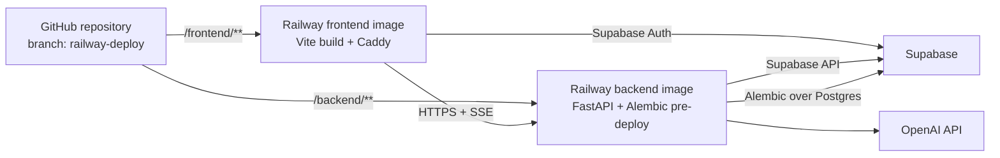

# Railway deployment plan

This is the repository-specific plan for deploying `investment-research-agent` to Railway from GitHub. See [`railway-setup.md`](./railway-setup.md) for the concise execution checklist.

## Decision summary

- Use the existing private Railway project `investment-research-agent` (`42cace43-5886-4706-b9f2-f8312e798507`) and its `production` environment (`7b864536-d01b-47f2-bf19-c44582daf6cf`).
- Create two Railway services named `backend` and `frontend`. Do not provision Railway Postgres: Supabase remains the database and authentication provider.
- Connect both services to `nicola-battoia/investment-research-agent`, initially using the exact branch name `railway-deploy`.
- Configure both empty services, their domains, and variables before connecting the GitHub source. Connecting the repository triggers a deployment, so source connection should be the last configuration step.
- Build both services from the Dockerfiles committed at their service roots. Leave Railway's custom Build and Start Commands empty so the images remain the source of truth.
- Run Alembic as the backend Pre-Deploy Command. Do not run it through `railway run` as the production migration mechanism.
- Treat `railway-deploy` as the first production candidate. After validation, merge it into `main` and make `main` the long-term production branch. If the branch is needed continuously, use it for a Railway `staging` environment instead.



## Repository-specific findings

### Backend deployment boundary

The backend service's Railway Root Directory must be `/backend`, not `/backend/app`.

`backend/app` contains the runtime Python package, but the build and deployment also require files at the backend root:

- `backend/pyproject.toml` and `backend/uv.lock` for dependency installation
- `backend/alembic.ini` and `backend/app/alembic/` for schema migrations
- the import path `app.main:app`

The ingestion, evaluation, notebook, and test directories are excluded from the image by `backend/.dockerignore`. The Dockerfile installs only the locked production dependency group, then copies the API package and Alembic configuration into a non-root runtime image. `ipykernel` was moved to the development group because the API does not import it.

The backend image starts with:

```sh
uvicorn app.main:app --host 0.0.0.0 --port ${PORT:-8000}
```

This command is encoded in `backend/Dockerfile`; do not duplicate it as a Railway Start Command. The shell wrapper is intentional because Docker's JSON command form does not expand `$PORT`. The fallback is convenient locally, while Railway supplies `PORT` in production.

### Frontend deployment boundary

The frontend service's Root Directory must be `/frontend`. It has its own `package.json` and `pnpm-lock.yaml` and does not depend on files in the backend.

`frontend/Dockerfile` uses a Node 22 build stage with pnpm 11.18.0, then copies only `dist` into the official Caddy image. Railway supplies the three `VITE_*` variables as Docker build arguments; the Dockerfile rejects missing values before running the Vite build.

`frontend/Caddyfile` provides an explicit `/health` response before the SPA fallback. It also compresses responses, gives Vite's fingerprinted `/assets/*` files immutable caching, and forces the SPA app shell to revalidate. Use `/health` as the frontend deployment healthcheck.

### Database and migrations

The application uses Supabase's HTTP APIs during normal backend requests. `DATABASE_URL` is used by Alembic for migrations and is still required by backend settings.

Use this Pre-Deploy Command on the backend:

```sh
alembic upgrade head
```

Alembic loads `app.config.settings`, so all required backend variables—not only `DATABASE_URL`—must exist when this command runs. Railway executes a Pre-Deploy Command after a successful build and before starting the new deployment; a failure prevents the release.

The URL scheme must be:

```text
postgresql+psycopg://...
```

The project's settings validator rejects a plain `postgresql://` URL. Prefer the Supabase direct connection on port `5432` for migrations and enable outbound IPv6 on the Railway backend service, because Supabase direct database hosts are IPv6 by default. If direct IPv6 cannot be used, use the Supavisor **session** pooler on port `5432` and retain the `postgresql+psycopg://` scheme. Do not use the transaction pooler on port `6543` for Alembic migrations.

Percent-encode any reserved characters in the database password before placing it in the URL.

The complete migration chain currently reaches revision `0008`. Offline SQL generation through all revisions succeeded. A live migration was deliberately not run during planning.

## Target Railway service configuration

| Setting | `backend` | `frontend` |
| --- | --- | --- |
| GitHub repository | `nicola-battoia/investment-research-agent` | same |
| Initial branch | `railway-deploy` | `railway-deploy` |
| Root Directory | `/backend` | `/frontend` |
| Watch Paths | `/backend/**` | `/frontend/**` |
| Builder | Dockerfile (automatic detection) | Dockerfile (automatic detection) |
| Build Command | none; use `backend/Dockerfile` | none; use `frontend/Dockerfile` |
| Pre-Deploy Command | `alembic upgrade head` | none |
| Start Command | none; use the image `CMD` | none; use the Caddy image command |
| Healthcheck Path | `/health` | `/health` |
| Runtime | Python 3.13 slim image | Node 22 builder; Caddy 2.11.4 runtime |
| Public domain | required | required |
| Outbound IPv6 | enable if using the Supabase direct database host | not needed |

Watch Paths prevent a frontend-only commit from rebuilding the backend and vice versa. A commit that changes both directories correctly deploys both services.

The Dockerfiles pin the runtime families, and `frontend/package.json` pins pnpm 11.18.0 through its `packageManager` field. Minor image tags intentionally receive compatible patch and base-image security updates; digest pinning can be added later if the project adopts automated image-update tooling.

Select a Railway backend region close to the Supabase project region. The frontend is static and less latency-sensitive, but using the same region keeps the setup simple.

## Variables

Do not upload either local `.env` file wholesale. They include local-development values, and the backend file contains secrets. Set values deliberately in the Railway `production` environment.

### Backend

Required application settings:

```text
SUPABASE_URL
SUPABASE_ANON_KEY
SUPABASE_SERVICE_ROLE_KEY
DATABASE_URL
OPENAI_API_KEY
OPENAI_EMBEDDING_MODEL
OPENAI_EMBEDDING_DIMENSIONS
OPENAI_KEYWORD_MODEL
OPENAI_ASSISTANT_MODEL
OPENAI_ASSISTANT_REASONING_EFFORT
OPENAI_ASSISTANT_MAX_OUTPUT_TOKENS
ALLOWED_ORIGINS
```

Recommended explicit production settings:

```text
LOG_LEVEL=INFO
LOG_FORMAT=json
ASSISTANT_TRACE_MODE=summary
```

`DATABASE_PASSWORD` appears in the local environment file but is not a backend setting. It does not need to be copied separately when the password is already encoded in `DATABASE_URL`.

Do not set `PORT`; Railway supplies it. `ALLOWED_ORIGINS` must be the frontend's final HTTPS origin, with no path. Once Railway has generated a frontend domain, use a reference variable:

```text
ALLOWED_ORIGINS=https://${{frontend.RAILWAY_PUBLIC_DOMAIN}}
```

Keep `SUPABASE_SERVICE_ROLE_KEY`, `DATABASE_URL`, and `OPENAI_API_KEY` backend-only. Enter secrets through Railway's UI or CLI standard input so they are not exposed in shell history. Sealing them is reasonable after the deployment has been verified, but note that sealed variables cannot be revealed or automatically copied to PR environments.

### Frontend

The frontend requires these variables at build time:

```text
VITE_API_BASE_URL=https://${{backend.RAILWAY_PUBLIC_DOMAIN}}
VITE_SUPABASE_URL
VITE_SUPABASE_ANON_KEY
```

`VITE_*` values are declared as Docker build arguments and embedded in browser JavaScript during the Vite build. Only put public/browser-safe values under this prefix. The Supabase anon key is designed for browser use with Row Level Security; the service-role key is not.

Railway shared variables can reduce duplication. For example, create shared `SUPABASE_URL` and `SUPABASE_ANON_KEY` values and reference them from the services:

```text
# backend service
SUPABASE_URL=${{shared.SUPABASE_URL}}
SUPABASE_ANON_KEY=${{shared.SUPABASE_ANON_KEY}}

# frontend service
VITE_SUPABASE_URL=${{shared.SUPABASE_URL}}
VITE_SUPABASE_ANON_KEY=${{shared.SUPABASE_ANON_KEY}}
```

The frontend cannot use Railway private networking to reach the backend because the request originates in the user's browser. It must use the backend's public HTTPS domain.

## Deployment sequence

### 1. Clear the release checks

Before connecting GitHub, resolve the current backend release-check failures documented below. Re-run:

```sh
cd backend
uv run --locked pytest -m 'not integration'
uv run --locked ruff check app tests
uv run --locked ruff format --check app tests

cd ../frontend
pnpm exec tsc --noEmit
pnpm lint
pnpm build
```

Commit and push any fixes to `railway-deploy`.

### 2. Confirm Railway's GitHub App access

Before creating a source connection, confirm that `nicola-battoia/investment-research-agent` appears in Railway's repository selector. Railway's GitHub App authorization is separate from local `git`, the GitHub CLI, and Codex's own GitHub access, so those cannot prove what Railway is authorized to read. If the repository is missing, open the Railway GitHub App configuration in GitHub and add this repository to its selected-repository access.

### 3. Create empty Railway services

Create `backend` and `frontend` in the existing project and `production` environment without attaching a source yet. The project currently has no services, so there is no existing deployment to preserve.

Using empty services first makes it possible to establish stable service IDs and domains before the first source-triggered build.

### 4. Configure service settings

Apply the settings in the service table, including Root Directory, Watch Paths, Dockerfile builder, healthcheck paths, and backend outbound IPv6 when applicable. Leave custom Build and Start Commands empty.

MCP is suitable for structured project/service operations and avoids relying on the current working directory. The CLI should also use explicit `--project`, `--environment`, and `--service` identifiers in scripted work. `railway link` is optional local convenience, not part of GitHub CI/CD and not required for deployment.

### 5. Generate both public domains

Generate Railway domains for both empty services. The domains are needed to set CORS and the frontend API URL correctly before the first build.

Do not use a temporary localhost CORS value in production and then race to redeploy it. Cross-service reference variables allow both services to have their correct final values from the first release.

### 6. Set and review variables

Set shared/browser-safe values, backend secrets, model settings, cross-service domain references, and runtime pins. Review Railway's staged variable changes before applying them.

Also update the Supabase project's allowed web URLs to include the Railway frontend domain. The current frontend uses password sign-in, so OAuth/email redirect configuration is not exercised by that flow today; configuring the Site URL and allowed redirect URL is still prudent for password recovery or future magic-link/OAuth functionality.

### 7. Connect GitHub sources last

Connect each service to the repository and exact branch `railway-deploy`. In current CLI syntax, the operations are conceptually:

```sh
railway service source connect \
  --project 42cace43-5886-4706-b9f2-f8312e798507 \
  --environment production \
  --service backend \
  --repo nicola-battoia/investment-research-agent \
  --branch railway-deploy

railway service source connect \
  --project 42cace43-5886-4706-b9f2-f8312e798507 \
  --environment production \
  --service frontend \
  --repo nicola-battoia/investment-research-agent \
  --branch railway-deploy
```

This is the operation that connects a GitHub repository for automatic deployments. `railway link` only records which existing Railway project/environment/service the local directory should target for later CLI commands. `railway up` uploads local files and is a different deployment source; do not use it for this GitHub-source workflow.

Connecting the source should start the first deployments. Confirm in Railway that the source branch shown on both services is exactly `railway-deploy`.

### 8. Verify the release

Wait for terminal deployment status rather than treating “deployment started” as success. Verify:

1. The backend build succeeds and the Alembic Pre-Deploy Command reaches the current head.
2. `GET https://<backend-domain>/health` returns HTTP 200 with `{"status":"ok"}`.
3. The frontend root loads and refreshing a client-side route returns the SPA rather than 404.
4. A browser request from the frontend domain passes backend CORS.
5. Supabase password sign-in succeeds.
6. Chat creation, source retrieval, and the streaming assistant response work end to end.
7. Backend logs are structured JSON, contain no secret values, and show no repeated restarts.
8. A frontend-only test commit deploys only the frontend; a backend-only test commit deploys only the backend.

The current assistant request timeout is 180 seconds and the stream emits heartbeats. This is compatible with Railway's documented public-network request limits as long as the stream continues sending data.

### 9. Promote the branch strategy

Once the candidate is stable:

1. Merge `railway-deploy` into `main` through the normal review process.
2. Change both production services' source branch to `main`.
3. Keep `railway-deploy` only if it has a clear role, preferably as the source for a separate Railway `staging` environment.

The repository currently has no GitHub Actions workflows. Leave Railway's **Wait for CI** option off initially or deployments may wait for checks that do not exist. Add a GitHub workflow for the backend and frontend commands above, then enable Wait for CI so production deployment begins only after the commit's checks pass.

## Verification performed while preparing this plan

No cloud resources, database schema, or deployed services were changed during this audit.

Passing checks:

- Frontend TypeScript check: passed
- Frontend ESLint: passed
- Frontend production build: passed
- Backend Docker image: built and ran as the non-root `app` user; `/health` passed
- Frontend Docker image: built and ran; Caddy `/health`, SPA fallback, app-shell revalidation, and immutable asset caching passed
- Alembic offline generation from base through `0008` inside the backend image: passed
- Runtime dependency check: required `Europe/Madrid` timezone data exists and development-only `ipykernel` is absent
- Backend unit test suite: 227 passed and 10 integration tests were deselected

Release blockers found:

- One backend unit test fails: `tests/assistant/test_history.py::test_keeps_only_three_latest_complete_turns_and_removes_old_markers`. The test expects three retained turns, while the current setting default retains five.
- Ruff reports import-order errors in six test files.
- Ruff format check reports one unformatted test file.

The frontend build also warns that the main JavaScript chunk is approximately 802 kB before gzip. This is a performance follow-up, not a deployment blocker.

## What was retained or corrected from the original `railway-setup.md`

| Existing advice | Assessment and replacement |
| --- | --- |
| Use backend/frontend Dockerfiles and a frontend Caddyfile | Retained and implemented. Each service now has an explicit production image. |
| Leave the backend Start Command blank | Correct with the new Dockerfile: its `CMD` starts `app.main:app` and expands Railway's `PORT`. |
| Use `postgresql://...` for `DATABASE_URL` | Incorrect for the settings validator. Use `postgresql+psycopg://...`. |
| Frontend healthcheck `/health` returns `ok` | Retained and implemented explicitly in `frontend/Caddyfile` before the SPA fallback. |
| Deploy with `railway up ./backend` and `railway up ./frontend` | This uploads local code and bypasses the intended GitHub-source workflow. Connect both services to the GitHub repository and branch instead. |
| Run Alembic with `railway run ...` | `railway run` executes a local command with Railway variables. Configure `alembic upgrade head` as the backend Pre-Deploy Command. |
| Start with localhost CORS and update it later | Avoid the extra unsafe deployment. Create domains first, then use cross-service domain references before connecting the source. |
| Ingest with `uv sync --extra ingest` and `python -m ingest...` | These commands do not match this repository. The active one-off workflow is documented in `backend/ingestion/README.md` and uses the numbered scripts under `backend/ingestion/scripts/`. It should be run intentionally outside the web service. |
| MCP cannot configure service details or connect sources | Stale. The current Railway agent tooling can create empty services, update service configuration, generate domains, set variables, connect sources, and inspect deployments. The CLI remains useful for secret-safe standard input and reproducible explicit-ID commands. |

## Operational and rollback notes

- Railway keeps prior deployments. If application code is bad but the schema remains compatible, redeploy the last known-good commit/deployment.
- Alembic migrations should remain backward-compatible across a rolling release. Avoid destructive column drops or renames in the same release that removes their application usage.
- A successful Railway healthcheck gates the new deployment but is not continuous uptime monitoring. Add an external uptime check if production availability needs active monitoring.
- Never paste secrets into documentation, commit them, or pass them as visible CLI arguments.
- Keep ingestion as an explicit offline job until there is a real need for a Railway cron or worker service. The current architecture does not require a third service.

## Authoritative references

- [Railway monorepos](https://docs.railway.com/deployments/monorepo)
- [Railway GitHub autodeploys](https://docs.railway.com/deployments/github-autodeploys)
- [Railway Pre-Deploy Command](https://docs.railway.com/deployments/pre-deploy-command)
- [Railway healthchecks](https://docs.railway.com/deployments/healthchecks)
- [Railway variables and reference variables](https://docs.railway.com/variables)
- [Railway Dockerfile builds](https://docs.railway.com/builds/dockerfiles)
- [Railway build and start commands](https://docs.railway.com/builds/build-and-start-commands)
- [uv in Docker](https://docs.astral.sh/uv/guides/integration/docker/)
- [Caddy single-page application pattern](https://caddyserver.com/docs/caddyfile/patterns#single-page-apps-spas)
- [Railway public-network limits](https://docs.railway.com/networking/public-networking/specs-and-limits)
- [Railway outbound networking and IPv6](https://docs.railway.com/networking/outbound-networking)
- [Supabase database connection methods](https://supabase.com/docs/guides/database/connecting-to-postgres)
