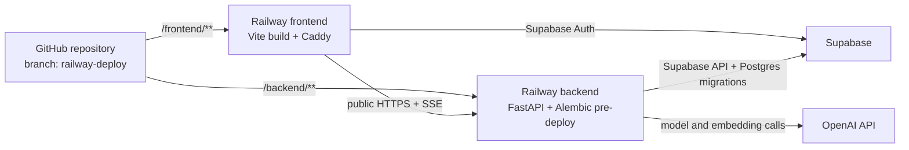

# Railway deployment plan

This document records the repository-specific deployment design, the first Railway release, the failures encountered, and the corrected path for future releases. Use [`railway-setup.md`](./railway-setup.md) for the complete command-by-command procedure.

## Deployment target

| Resource | Name | ID or URL |
| --- | --- | --- |
| Railway project | `10-K Club` | `42cace43-5886-4706-b9f2-f8312e798507` |
| Environment | `production` | `7b864536-d01b-47f2-bf19-c44582daf6cf` |
| Backend service | `backend` | `974a863b-2ee3-455e-a903-fec1c92343ca` |
| Frontend service | `frontend` | `a0149246-5f2c-4a2c-86f6-cb58279a5458` |
| Backend domain | — | `https://10k-club-backend.up.railway.app` |
| Frontend domain | — | `https://10k-club.up.railway.app` |
| GitHub source | — | `nicola-battoia/investment-research-agent` |
| Initial branch | — | `railway-deploy` |

## Decisions

- Use the existing private Railway project and its `production` environment.
- Deploy the GitHub monorepo as two services: `backend` and `frontend`.
- Keep Supabase as the database and authentication provider; do not provision Railway Postgres.
- Create and configure empty services before attaching GitHub. Source attachment triggers the first build and therefore comes last.
- Explicitly select the committed Dockerfiles. Leave Railway custom Build and Start Commands empty so the images remain the source of truth.
- Run `alembic upgrade head` as the backend Pre-Deploy Command, not through `railway run`.
- Use the active public domains returned by `railway domain list` for CORS and the frontend build.
- Deploy `railway-deploy` as the first candidate, then merge it into `main` and make `main` the long-term production branch after every release gate passes.



## Repository deployment boundaries

### Backend

The backend Root Directory is `/backend`, not `/backend/app`. The build needs `pyproject.toml`, `uv.lock`, `alembic.ini`, `app/alembic/`, and the `app.main:app` import path from the backend root.

`backend/.dockerignore` excludes tests, notebooks, evaluation code, and ingestion payloads. The production image installs the locked runtime dependencies, copies the API and migration files, and runs as a non-root user.

The image starts Uvicorn using Railway's injected port:

```sh
uvicorn app.main:app --host 0.0.0.0 --port ${PORT:-8000}
```

The command belongs in `backend/Dockerfile`. Do not duplicate it as a Railway Start Command.

### Frontend

The frontend Root Directory is `/frontend`. `frontend/Dockerfile` builds with Node and pnpm, validates the required `VITE_*` build arguments, and copies only `dist` into the Caddy runtime image.

`frontend/Caddyfile` serves `/health` before the SPA fallback, compresses responses, gives fingerprinted assets immutable caching, and makes client-side routes such as `/sign-in` return the SPA rather than 404.

### Database and migrations

Normal backend requests use Supabase's HTTP APIs. `DATABASE_URL` is nevertheless required by backend settings and Alembic.

It must use:

```text
postgresql+psycopg://...
```

The settings validator rejects plain `postgresql://`. Use either:

- Supabase direct `db.<project-ref>.supabase.co:5432`, with Railway backend outbound IPv6 enabled; or
- Supavisor session pooler `*.pooler.supabase.com:5432`, with outbound IPv6 left disabled.

Do not use the transaction pooler on port `6543` for Alembic. Percent-encode reserved password characters in the URL.

This deployment uses the Supavisor session pooler on port `5432`, so `ipv6EgressEnabled: false` is correct.

## Target service configuration

| Setting | `backend` | `frontend` |
| --- | --- | --- |
| Service ID | `974a863b-2ee3-455e-a903-fec1c92343ca` | `a0149246-5f2c-4a2c-86f6-cb58279a5458` |
| Repository | `nicola-battoia/investment-research-agent` | same |
| Initial branch | `railway-deploy` | `railway-deploy` |
| Root Directory | `/backend` | `/frontend` |
| Watch Paths | `/backend/**` | `/frontend/**` |
| Builder | `DOCKERFILE` | `DOCKERFILE` |
| Build Environment | `V3` | `V3` |
| Dockerfile Path | `/backend/Dockerfile` | `/frontend/Dockerfile` |
| Custom Build Command | empty | empty |
| Pre-Deploy Command | `alembic upgrade head` | empty |
| Custom Start Command | empty | empty |
| Healthcheck Path | `/health` | `/health` |
| Public domain | required | required |
| Outbound IPv6 | disabled for current session-pooler URL | disabled |
| Replicas | one, EU West | one, EU West |

The deployment manifest—not the editable configuration summary—is the final proof of which builder ran. It must report `DOCKERFILE` and the correct path for each service.

Watch Paths prevent a frontend-only commit from rebuilding the backend and vice versa. A commit touching both service directories correctly rebuilds both.

## Variables and domain wiring

Do not upload local `.env` files wholesale and do not set `PORT`; Railway supplies it.

Backend settings:

```text
SUPABASE_URL
SUPABASE_ANON_KEY
SUPABASE_SERVICE_ROLE_KEY
DATABASE_URL
OPENAI_API_KEY
OPENAI_EMBEDDING_MODEL
OPENAI_EMBEDDING_DIMENSIONS
OPENAI_KEYWORD_MODEL
OPENAI_ASSISTANT_MODEL
OPENAI_ASSISTANT_REASONING_EFFORT
OPENAI_ASSISTANT_MAX_OUTPUT_TOKENS
ALLOWED_ORIGINS=https://10k-club.up.railway.app
LOG_LEVEL=INFO
LOG_FORMAT=json
ASSISTANT_TRACE_MODE=summary
```

Frontend build-time settings:

```text
VITE_API_BASE_URL=https://10k-club-backend.up.railway.app
VITE_SUPABASE_URL
VITE_SUPABASE_ANON_KEY
```

`ALLOWED_ORIGINS` is the exact frontend origin, including `https://` and with no path or trailing slash. `VITE_API_BASE_URL` is the backend origin.

The `VITE_*` values are public and embedded in browser JavaScript at image-build time. Never put the service-role key or another secret under that prefix. Changing `VITE_API_BASE_URL` requires a new frontend build to reach `SUCCESS`, followed by a browser hard refresh.

For this project, set both final domain values explicitly after reading them with `railway domain list`. During the first release, a `${{backend.RAILWAY_PUBLIC_DOMAIN}}` reference resolved to a superseded generated domain after the domain was renamed, and Vite permanently compiled that stale URL into its bundle.

Enter `SUPABASE_SERVICE_ROLE_KEY`, `DATABASE_URL`, and `OPENAI_API_KEY` through hidden shell input and `railway variable set --stdin`. Never expose them in command arguments, documentation, screenshots, chat, or logs.

Be careful with CLI inspection: `railway environment config --json` and `railway variable list --json` can return raw variable values. Run them only in a private terminal and never paste their output. Treat any shared output containing those values as a credential exposure and rotate the affected secrets.

In Supabase Dashboard → Authentication → URL Configuration:

- Set Site URL to `https://10k-club.up.railway.app`.
- Add the same production URL as an allowed redirect URL.
- Keep `http://localhost:5173` in allowed redirects while local Vite development is supported.

Password sign-in does not use a redirect today. The entries are used by password recovery and any future magic-link or OAuth flow; the localhost entry allows those flows to return to the local frontend during development.

## Correct deployment sequence

The exact commands and expected outputs for every phase are in [`railway-setup.md`](./railway-setup.md).

### 1. Clear release checks

Run the locked backend test and Ruff checks, then the frontend TypeScript, ESLint, and production-build checks. The corrected release passed 228 backend tests and every listed check.

### 2. Authenticate, link, and confirm GitHub access

Link the repository to project `10-K Club` and environment `production`, verify both IDs, and confirm the Railway GitHub App can see the private repository. Local GitHub access does not prove Railway App access.

### 3. Create empty services

Create `backend` and `frontend` with no source. When `railway add` prompts for a variable, press `Esc`; variables are added deliberately later. Record the generated service IDs and do not create duplicates.

### 4. Configure service settings

Set Root Directory, explicit Dockerfile builder and path, Watch Paths, healthchecks, and the backend Pre-Deploy Command. Leave custom Build and Start Commands empty. Decide IPv6 from the database hostname and port, not by guesswork.

### 5. Generate public domains

Generate and list a domain for each empty service. Use the final active values returned by `railway domain list`, not a prior generated name.

### 6. Set variables and Supabase URLs

Set browser-safe values directly and secrets through standard input. Verify that the OpenAI API project owning the key has an active balance and sufficient limits; a ChatGPT or Codex subscription does not fund API usage.

Configure the production and localhost URLs in Supabase Authentication as described above.

### 7. Commit and push the candidate

The GitHub source deploys the remote branch, not local uncommitted files. Confirm all required changes are committed, push `railway-deploy`, and verify the local/remote revision count is `0 0` before attaching sources.

### 8. Attach GitHub sources last

Connect both services to the same repository and exact `railway-deploy` branch. This starts both initial deployments.

Use `railway service source connect`; do not use `railway up`, which uploads local files and establishes a different deployment source. Do not use `railway run` for production migrations; it runs a local process with Railway variables.

### 9. Verify the release

Wait for both deployments to reach `SUCCESS`, then verify:

1. The deployment manifests show the expected commit, Dockerfile builders, roots, Watch Paths, backend migration, and healthchecks.
2. Both `/health` endpoints return 200.
3. A frontend client-side route returns the SPA.
4. The CORS preflight returns the exact frontend HTTPS origin.
5. The compiled frontend bundle contains the active backend URL and no obsolete Railway domain.
6. Supabase sign-in, chat creation, retrieval, and the streamed assistant answer work end to end.
7. Logs contain no secrets, prompts, retrieved documents, or serialized frame-local state and show no repeated restarts.
8. Isolated frontend-only and backend-only commits prove the Watch Paths.

An HTTP 200 from `/chat/stream` proves only that the SSE connection opened. The stream can still emit a structured failure event, so a visible assistant answer is part of the release gate.

### 10. Promote the branch

After every gate passes, merge `railway-deploy` into `main`, change both production services to `main`, and retain `railway-deploy` only if it becomes the source of a separate staging environment.

The repository currently has no GitHub Actions workflows. Keep Railway **Wait for CI** disabled until equivalent checks exist in GitHub Actions.

### 11. Run ingestion separately

Ingestion is an intentional offline operation, not a web-service startup task or migration. Use the numbered workflow in [`../../backend/ingestion/README.md`](../../backend/ingestion/README.md).

## First release record

The candidate deployed commit `118a2af7837e74e1f3af8da600648b12f9355bb7` from `railway-deploy`.

| Service | Deployment ID | Railway status | Verified |
| --- | --- | --- | --- |
| `backend` | `cb1e1242-4c81-4bec-96e5-83777f258f4b` | `SUCCESS` | Dockerfile build, Alembic pre-deploy, runtime start, `/health`, HTTPS CORS, Supabase-authenticated chat endpoints |
| `frontend` | `f3d5ac02-2657-4ba0-b481-a162f882dabf` | `SUCCESS` | Dockerfile build, Caddy `/health`, SPA routing, active backend URL in rebuilt bundle |

Both services run one replica in EU West and showed no crash loop. A successful Railway status means the containers deployed; it does not by itself prove every external API dependency works.

## Problems found and the corrected approach

| Symptom | Cause | Correct approach |
| --- | --- | --- |
| Frontend reported that it could not reach the API | Backend CORS allowed the wrong origin | Set `ALLOWED_ORIGINS` to the exact active frontend HTTPS origin, wait for the backend redeploy, then verify with an OPTIONS preflight. `http` and `https` are different origins. |
| CORS passed but the frontend still could not reach the API | `VITE_API_BASE_URL` had been compiled with an obsolete backend domain that returned Railway's `Application not found` | Read the active domain with `railway domain list`, set the explicit URL, wait for a new frontend build to finish, inspect the compiled asset, then hard-refresh. A restart alone cannot change Vite build-time values. |
| UI showed “The research assistant is temporarily unavailable” | The SSE route opened, but the OpenAI call returned `429 credit_balance_exhausted` | Fund the OpenAI API organization/project that owns the existing key, or replace it with a funded key through `--stdin`. Adding credits to the current key does not require a Railway redeploy. |
| Railway showed some `INFO` startup messages with error severity | Alembic and Uvicorn wrote informational messages to stderr, which Railway classified by stream | Read the message and process state, not severity alone. One Pre-Deploy container stop followed by the runtime start is expected; repeated runtime restarts are not. |
| One exception log was extremely large and contained prompts and runtime-local data | Structured exception logging rendered `exc_info=True` with a verbose traceback containing frame locals and tool schemas | Harden production exception serialization before promotion. Log a bounded error type/code and correlation ID; do not include full prompts, conversation history, retrieved passages, secrets, or frame-local variables. This did not cause the model failure but is a security, privacy, cost, and observability risk. |
| `GET /` and `/favicon.ico` returned backend 404s | The API intentionally defines `/health` and API routes, not a homepage | Verify `/health`; the two 404s are expected. |

## Current production gates

Completed:

- 228 backend tests and all Ruff checks passed.
- Frontend TypeScript, ESLint, and production build passed.
- Both production Docker images deployed successfully.
- Alembic reached the current migration head.
- Backend and frontend healthchecks passed.
- SPA routing, HTTPS CORS, and the compiled frontend API URL were corrected and verified.
- Supabase password authentication and chat creation/list/get reached the backend successfully.

Still required before final promotion:

- Restore a usable OpenAI API balance and verify a complete streamed assistant response and retrieval/citation flow.
- Harden exception logging so production events are bounded and exclude prompts, conversation content, retrieved text, and frame locals.
- Prove Watch Paths with isolated frontend-only and backend-only commits.
- Merge the candidate to `main` and change the production branch only after the gates above pass.

The frontend bundle-size warning is a performance follow-up, not a deployment blocker.

## Operational and rollback notes

- Railway retains prior deployments. If application code is bad and the database schema remains compatible, redeploy the last known-good deployment.
- Keep Alembic migrations backward-compatible across rolling releases. Avoid destructive column changes in the same release that removes their application usage.
- A successful Railway healthcheck gates a deployment but is not continuous monitoring. Add an external uptime check if production availability needs active monitoring.
- Always bound `railway logs` with `--lines`, `--since`, or `--until`; otherwise it streams indefinitely.
- Keep ingestion as an explicit offline job until a Railway cron or worker has a demonstrated need. The current architecture needs only two services.

## Authoritative references

- [Railway monorepos](https://docs.railway.com/deployments/monorepo)
- [Railway GitHub autodeploys](https://docs.railway.com/deployments/github-autodeploys)
- [Railway Pre-Deploy Command](https://docs.railway.com/deployments/pre-deploy-command)
- [Railway healthchecks](https://docs.railway.com/deployments/healthchecks)
- [Railway variables and reference variables](https://docs.railway.com/variables)
- [Railway Dockerfile builds](https://docs.railway.com/builds/dockerfiles)
- [Railway public-network limits](https://docs.railway.com/networking/public-networking/specs-and-limits)
- [Railway outbound networking and IPv6](https://docs.railway.com/networking/outbound-networking)
- [Supabase database connection methods](https://supabase.com/docs/guides/database/connecting-to-postgres)
- [Caddy single-page application pattern](https://caddyserver.com/docs/caddyfile/patterns#single-page-apps-spas)
