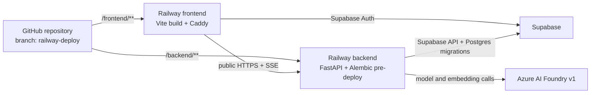

# Railway design and release history

This document records the repository-specific deployment design, the first Railway release, the failures encountered, and the corrected path for future releases. Use [`railway-setup.md`](./railway-setup.md) for the complete command-by-command procedure.


**Historical record:** resource IDs, capacities, deployed commits, and completed
checks below describe the recorded releases. They are not a fresh cloud inventory.
For September 5 working-tree findings and verification, use the
[repository audit](../repository-audit.md).

## Recorded deployment target

| Resource | Name | ID or URL |
| --- | --- | --- |
| Railway project | `10-K Club` | `42cace43-5886-4706-b9f2-f8312e798507` |
| Environment | `production` | `7b864536-d01b-47f2-bf19-c44582daf6cf` |
| Backend service | `backend` | `974a863b-2ee3-455e-a903-fec1c92343ca` |
| Frontend service | `frontend` | `a0149246-5f2c-4a2c-86f6-cb58279a5458` |
| Backend domain | — | `https://10k-club-backend.up.railway.app` |
| Frontend domain | — | `https://10k-club.up.railway.app` |
| GitHub source | — | `nicola-battoia/investment-research-agent` |
| Initial branch | — | `railway-deploy` |

## Decisions

- Use the existing private Railway project and its `production` environment.
- Deploy the GitHub monorepo as two services: `backend` and `frontend`.
- Keep Supabase as the database and authentication provider; do not provision Railway Postgres.
- Create and configure empty services before attaching GitHub. Source attachment triggers the first build and therefore comes last.
- Explicitly select the committed Dockerfiles. Leave Railway custom Build and Start Commands empty so the images remain the source of truth.
- Run `alembic upgrade head` as the backend Pre-Deploy Command, not through `railway run`.
- Use the active public domains returned by `railway domain list` for CORS and the frontend build.
- Deploy `railway-deploy` as the first candidate, then merge it into `main` and make `main` the long-term production branch after every release gate passes.



## Repository deployment boundaries

### Backend

The backend Root Directory is `/backend`, not `/backend/app`. The build needs `pyproject.toml`, `uv.lock`, `alembic.ini`, `app/alembic/`, and the `app.main:app` import path from the backend root.

`backend/.dockerignore` excludes tests, notebooks, evaluation code, and ingestion payloads. The production image installs the locked runtime dependencies, copies the API and migration files, and runs as a non-root user.

The image starts Uvicorn using Railway's injected port:

```sh
uvicorn app.main:app --host 0.0.0.0 --port ${PORT:-8000} --no-access-log
```

The command belongs in `backend/Dockerfile`. Do not duplicate it as a Railway Start Command.

### Frontend

The frontend Root Directory is `/frontend`. `frontend/Dockerfile` builds with Node and pnpm, validates the required `VITE_*` build arguments, and copies only `dist` into the Caddy runtime image.

`frontend/Caddyfile` serves `/health` before the SPA fallback, compresses responses, gives fingerprinted assets immutable caching, and makes client-side routes such as `/sign-in` return the SPA rather than 404.

### Database and migrations

Normal backend requests use Supabase's HTTP APIs. `DATABASE_URL` is nevertheless required by backend settings and Alembic.

It must use:

```text
postgresql+psycopg://...
```

The settings validator rejects plain `postgresql://`. Use either:

- Supabase direct `db.<project-ref>.supabase.co:5432`, with Railway backend outbound IPv6 enabled; or
- Supavisor session pooler `*.pooler.supabase.com:5432`, with outbound IPv6 left disabled.

Do not use the transaction pooler on port `6543` for Alembic. Percent-encode reserved password characters in the URL.

The recorded deployment used the Supavisor session pooler on port `5432`, so `ipv6EgressEnabled: false` is correct.

## Target service configuration

| Setting | `backend` | `frontend` |
| --- | --- | --- |
| Service ID | `974a863b-2ee3-455e-a903-fec1c92343ca` | `a0149246-5f2c-4a2c-86f6-cb58279a5458` |
| Repository | `nicola-battoia/investment-research-agent` | same |
| Initial branch | `railway-deploy` | `railway-deploy` |
| Root Directory | `/backend` | `/frontend` |
| Watch Paths | `/backend/**` | `/frontend/**` |
| Builder | `DOCKERFILE` | `DOCKERFILE` |
| Build Environment | `V3` | `V3` |
| Dockerfile Path | `/backend/Dockerfile` | `/frontend/Dockerfile` |
| Custom Build Command | empty | empty |
| Pre-Deploy Command | `alembic upgrade head` | empty |
| Custom Start Command | empty | empty |
| Healthcheck Path | `/health` | `/health` |
| Public domain | required | required |
| Outbound IPv6 | disabled for current session-pooler URL | disabled |
| Replicas | one, EU West | one, EU West |

The deployment manifest—not the editable configuration summary—is the final proof of which builder ran. It must report `DOCKERFILE` and the correct path for each service.

Watch Paths prevent a frontend-only commit from rebuilding the backend and vice versa. A commit touching both service directories correctly rebuilds both.

## Configuration and release procedure

Use the [Railway runbook](railway-setup.md) for commands and the
[configuration reference](../configuration.md) for required variables and the
difference between current defaults and the recorded operator profile. Keeping the
procedure there avoids two competing copies of the same deployment instructions.

The intended sequence for a new environment is: verify account/project access;
create empty services; configure Docker roots, Watch Paths, pre-deploy migration,
and healthchecks; obtain final public domains; set variables; then attach the
reviewed GitHub branch. Existing services should be reused for routine releases.

`ALLOWED_ORIGINS` is the frontend origin; `VITE_API_BASE_URL` is the backend
origin. Vite embeds public configuration at build time. During the first release,
a `${{backend.RAILWAY_PUBLIC_DOMAIN}}` reference resolved to a superseded domain
after a rename. The correction was to read the active domain and rebuild with its
explicit value.

Secrets belong in the backend secret store. Raw environment/variable inspection
can reveal their values; use a private terminal. The frontend receives only its
three public `VITE_*` values.

Release verification must cover the deployed commit and manifest, migration,
healthchecks, CORS, compiled frontend URL, and signed-in chat/citation behavior.
An HTTP 200 from `/chat/stream` only means SSE opened; a structured failure can
still arrive later. Verify `stream.completed` and persisted results.

The original plan used `railway-deploy` as a candidate branch and proposed
promotion to `main` after the gates below. Verify the current source branches
before acting on that plan. No GitHub Actions workflows are present in the
reviewed repository; the decision to enable Railway's Wait for CI requires actual
matching checks.

Ingestion stays a separate operator task. Follow the
[ingestion guide](../../backend/ingestion/README.md); do not attach bulk parsing,
embedding, or upload to web-service startup or migrations.

## First release record

The candidate deployed commit `118a2af7837e74e1f3af8da600648b12f9355bb7` from `railway-deploy`.

| Service | Deployment ID | Railway status | Verified |
| --- | --- | --- | --- |
| `backend` | `cb1e1242-4c81-4bec-96e5-83777f258f4b` | `SUCCESS` | Dockerfile build, Alembic pre-deploy, runtime start, `/health`, HTTPS CORS, Supabase-authenticated chat endpoints |
| `frontend` | `f3d5ac02-2657-4ba0-b481-a162f882dabf` | `SUCCESS` | Dockerfile build, Caddy `/health`, SPA routing, active backend URL in rebuilt bundle |

Both services ran one replica in EU West and showed no crash loop in that release check. A successful Railway status means the containers deployed; it does not by itself prove every external API dependency works.

## Foundry reliability rollout record

Backend commit `71467aecd0168e0ad4dd7540aa07bb1a3040fbad` deployed from
`railway-deploy` as Railway deployment
`8c853f44-7a4c-4e34-87e5-40d70f3f180f`. Railway built
`backend/Dockerfile`, completed the Alembic pre-deploy step, passed `/health`,
and reported `SUCCESS`.

Before deploying the code, the Azure Foundry allocations were changed and
verified as `GlobalStandard` and `Succeeded`: assistant capacity 100
(100 RPM/100,000 TPM), keyword capacity 25 (25 RPM/25,000 TPM), and unchanged
embedding capacity 10 (10 RPM/10,000 TPM).

Controlled live checks against the production Foundry deployments and Supabase
corpus completed a conversational turn, a single-filing AAPL turn, a
multi-filing MSFT/NVDA turn, and two back-to-back multi-search turns. The final
two turns used 42,390 and 50,831 actual total tokens and produced cited answers
without an Azure 429. An authenticated production-browser turn could not be run
because the available browser had no private-pilot session and the opt-in test
JWT had expired.

The deployment was monitored from `2026-08-28T16:08:19Z` through at least
`2026-08-29T00:07:19Z`. Railway recorded 46 HTTP requests: 45 successful 2xx
responses, the expected 401 from an explicit unauthenticated probe, and zero
5xx responses. Focused runtime logs contained no Azure rate-limit, Supabase
timeout, unhandled ASGI, `assistant_rate_limited`, or `database_unavailable`
event. CPU was zero and memory was approximately 0.157 GB of 1 GB at
the final snapshot.

## Problems found and the corrected approach

| Symptom | Cause | Correct approach |
| --- | --- | --- |
| Frontend reported that it could not reach the API | Backend CORS allowed the wrong origin | Set `ALLOWED_ORIGINS` to the exact active frontend HTTPS origin, wait for the backend redeploy, then verify with an OPTIONS preflight. `http` and `https` are different origins. |
| CORS passed but the frontend still could not reach the API | `VITE_API_BASE_URL` had been compiled with an obsolete backend domain that returned Railway's `Application not found` | Read the active domain with `railway domain list`, set the explicit URL, wait for a new frontend build to finish, inspect the compiled asset, then hard-refresh. A restart alone cannot change Vite build-time values. |
| UI says the research model is busy | The SSE route opened, but Azure Foundry returned `429 rate_limit_exceeded`; the outer HTTP status may still be 200 | Correlate the trace, inspect only the safe numeric retry/limit/remaining/reset fields, confirm assistant capacity 100 and the configured turn budgets, then honor `retry_after_ms`. Escalate sustained shared-capacity throttling to Azure. |
| Authentication or database becomes unavailable | A Supabase HTTP read/connect deadline was reached before or during the SSE turn | Before streaming, expect HTTP 503 with a human-readable `detail`; the corresponding log code identifies authentication/database unavailability. After streaming starts, expect retryable `database_unavailable` inside the HTTP-200 SSE response. Check Supabase status and reachability; it must not become an unhandled ASGI exception. |
| Railway showed some `INFO` startup messages with error severity | Alembic and Uvicorn wrote informational messages to stderr, which Railway classified by stream | Read the message and process state, not severity alone. One Pre-Deploy container stop followed by the runtime start is expected; repeated runtime restarts are not. |
| One exception log was extremely large and contained prompts and runtime-local data | Structured exception logging rendered `exc_info=True` with a verbose traceback containing frame locals and tool schemas | Production now uses metadata-only summary traces, a strict scalar allowlist, safe structured error codes, and a 4 KiB event ceiling in that profile. Local development retains the full trace. This application-log rule does not sanitize the new Azure spans. |
| `GET /` and `/favicon.ico` returned backend 404s | The API intentionally defines `/health` and API routes, not a homepage | Verify `/health`; the two 404s are expected. |

## Gates recorded after the August 28–29 rollout

Recorded completed checks (not rerun against production during the September 5 audit):

- 260 fast backend tests and Ruff checks for the application and test paths passed.
- Frontend TypeScript, ESLint, and production build passed.
- Both production Docker images deployed successfully.
- Alembic reached the current migration head.
- Backend and frontend healthchecks passed.
- SPA routing, HTTPS CORS, and the compiled frontend API URL were corrected and verified.
- Supabase password authentication and chat creation/list/get reached the backend successfully.
- Production logging hardening deployed in commit `83c3459` (Railway deployment
  `78895768-eb1a-4286-bdc3-27146092e83e`). The healthcheck passed, and a bounded
  audit of the new deployment's runtime logs found no event over 4 KiB and no
  traceback, frame-local, content, or disallowed-correlation-ID patterns.
- Foundry reliability hardening deployed in commit `71467ae` (Railway deployment
  `8c853f44-7a4c-4e34-87e5-40d70f3f180f`) and remained healthy through the
  extended monitoring window described above.

Still required before final promotion:

- Run conversational, single-filing, multi-filing, and back-to-back multi-search
  turns through a signed-in production frontend session. Confirm each trace ends in
  `stream.completed`, persists its citations, stays inside the configured usage
  bounds, and contains no Azure 429 or unhandled ASGI exception.
- Prove Watch Paths with isolated frontend-only and backend-only commits.
- Merge the candidate to `main` and change the production branch only after the gates above pass.

The frontend bundle-size warning is a performance follow-up, not a deployment blocker.

## Operational and rollback notes

- Railway retains prior deployments. If application code is bad and the database schema remains compatible, redeploy the last known-good deployment.
- Keep Alembic migrations backward-compatible across rolling releases. Avoid destructive column changes in the same release that removes their application usage.
- A successful Railway healthcheck gates a deployment but is not continuous monitoring. Add an external uptime check if production availability needs active monitoring.
- Always bound `railway logs` with `--lines`, `--since`, or `--until`; otherwise it streams indefinitely.
- Keep ingestion as an explicit offline job until a Railway cron or worker has a demonstrated need. The current architecture needs only two services.

## Authoritative references

- [Railway monorepos](https://docs.railway.com/deployments/monorepo)
- [Railway GitHub autodeploys](https://docs.railway.com/deployments/github-autodeploys)
- [Railway Pre-Deploy Command](https://docs.railway.com/deployments/pre-deploy-command)
- [Railway healthchecks](https://docs.railway.com/deployments/healthchecks)
- [Railway variables and reference variables](https://docs.railway.com/variables)
- [Railway Dockerfile builds](https://docs.railway.com/builds/dockerfiles)
- [Railway public-network limits](https://docs.railway.com/networking/public-networking/specs-and-limits)
- [Railway outbound networking and IPv6](https://docs.railway.com/networking/outbound-networking)
- [Supabase database connection methods](https://supabase.com/docs/guides/database/connecting-to-postgres)
- [Caddy single-page application pattern](https://caddyserver.com/docs/caddyfile/patterns#single-page-apps-spas)
